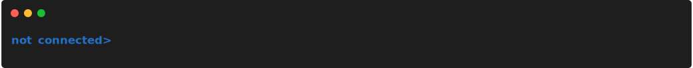

# Short Description
{: .no_toc }

## Table of contents
{: .no_toc .text-delta }

1. TOC
{:toc}

---

## Support of Word Completion
The FSH application is build up with the help of [linenoise](https://github.com/muhkuh-sys/com.github.hoelzro-lua-linenoise). Therefore, hints and word completion are provided. Word completion can be applied by pressing the <kbd>tab</kbd> key as shown in the examples below:  
  

  

  

  

  

  

