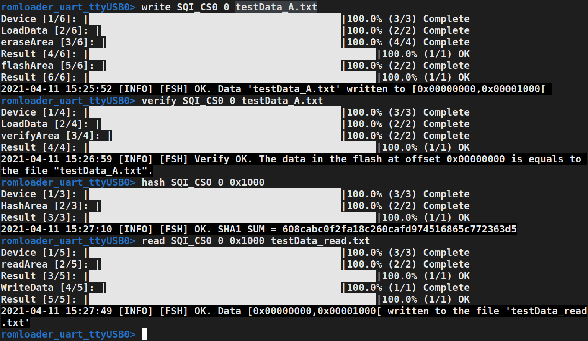
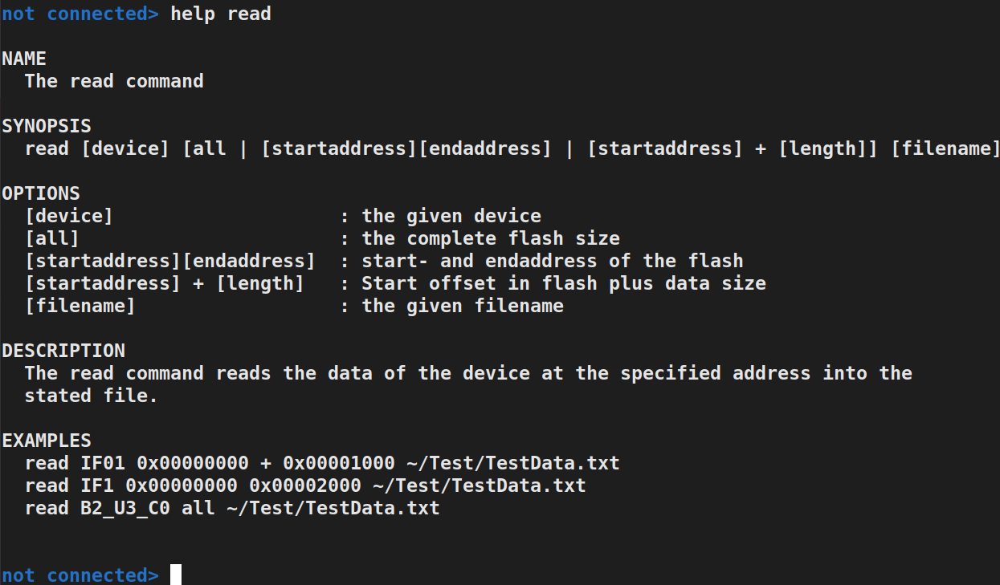
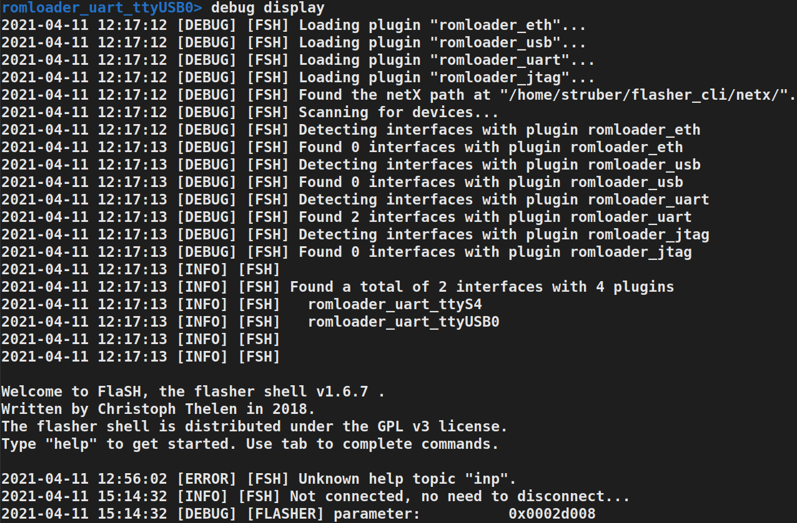
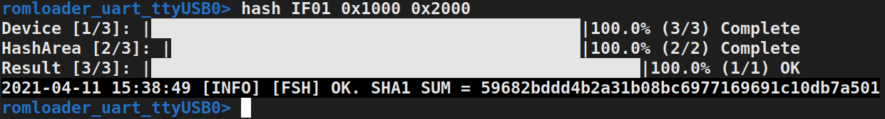

# Release Notes
{: .no_toc }
The release notes of the flasher shell.

## Table of contents
{: .no_toc .text-delta }

1. TOC
{:toc}

---

## Release Notes 1.6.8

### Adding Progress Bar Information

The respective commands now show their progress through progress bar information.

  

### Expanding the Help Command - New Design

  

### New Feature: Input Command

The input command reads a file with commands (one command per line) and executes them after the commands have been validated. An example of the input command can be seen in the following: 

### New Feature: List Command

The list command activates the list mode and supports the creation and editing of a list of commands. Numerous auxiliary commands are available within this mode. The following clip shows an example of the list command:

### New Feature: Debug Command 

The debug command enables debug information to be displayed or saved.

  

### Hash Command:  Expanded for Internal Flash

  

### Adding Documentation (LDOC) of fsh.lua, progressbar.lua and flasher.lua 

The documentation of the modules can be found [here](https://muhkuh-sys.github.io//org.muhkuh.tools-flasher_pt/index_LDOC.html).

### Improvement of Minor Bugs

## Release Notes 1.6.9

### Shortcuts of Plugin Names in the Connect Command

This new feature allows to use shortcuts of plugin names in the connect command. However, the abbreviation must be clearly assigned to a plugin name in the list of all possible plugins (see scan command). In the case that more than one plugin name can be assigned to the shortcut, the shortcut will not be recognized as plugin name and an error will arise.

### Input Command directly through Argument

This is an additional option to use the input command directly by the argument "-i" or "--input". Further information of the different options of the input command can be found "[input command](https://muhkuh-sys.github.io//org.muhkuh.tools-flasher_pt/Input_Command.html)".

### Minor Improvement or Bugs

- Wrong description of progress bar in function __getRange (fsh.lua)
- Change order of statement in function __run_write (fsh.lua) due to wrong display of progress bar information in case of an error in eraseArea
- Add error message in connect command if plugin was not found (fsh.lua)
- Change fill of progress bar due to unknown symbol in OS windows (progressbar.lua)
- Add return nil value in function isErased in the case of call fails (flasher.lua)
- Remove double default callback functions (flasher.lua)
- Remove of 'local this' in functions: write_image (and return), read_image, call (and return) (flasher.lua)
- Additional comments of LDOC
- Change color settings for different operating systems - linux and windows (fsh.lua)